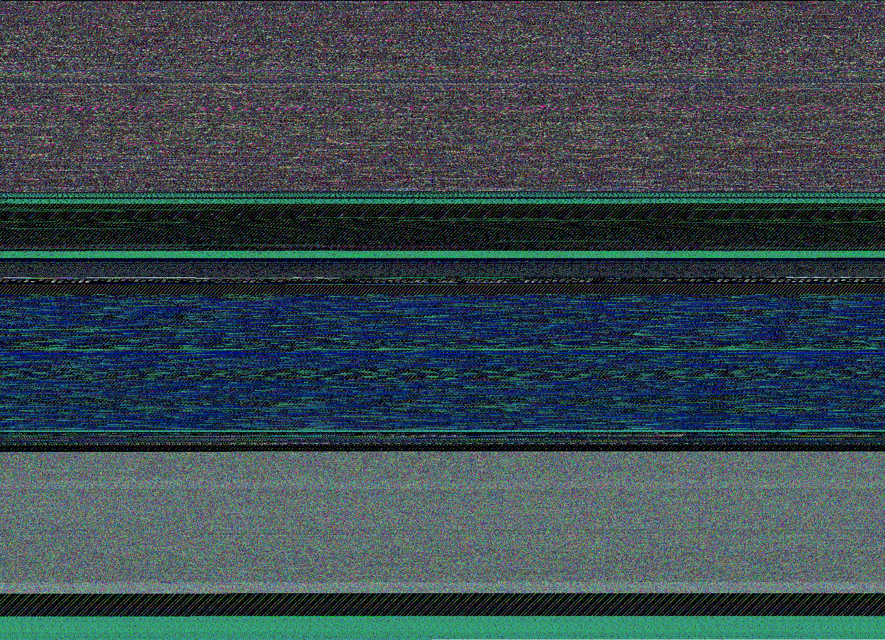
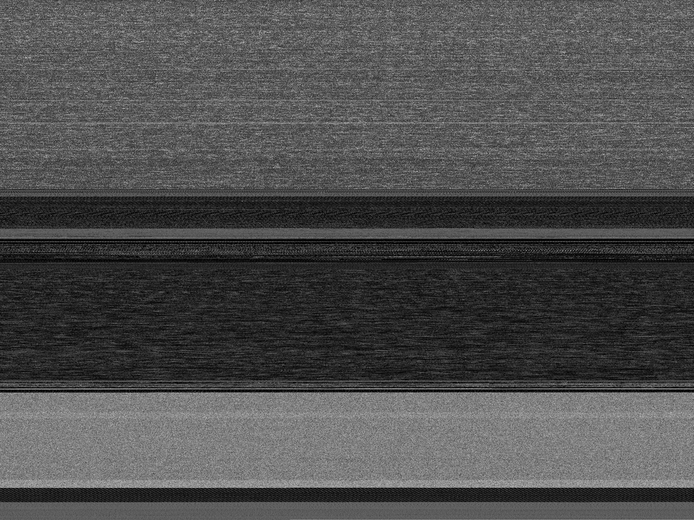
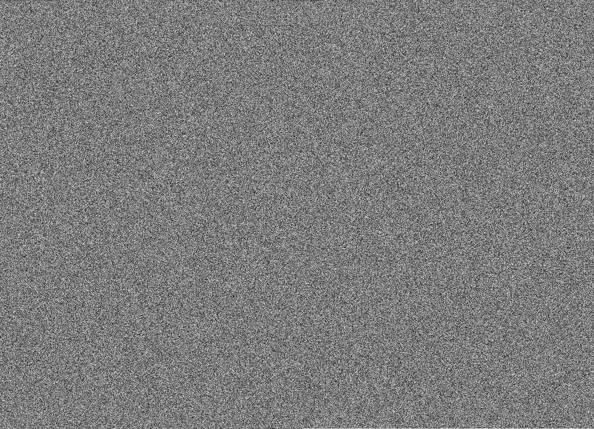
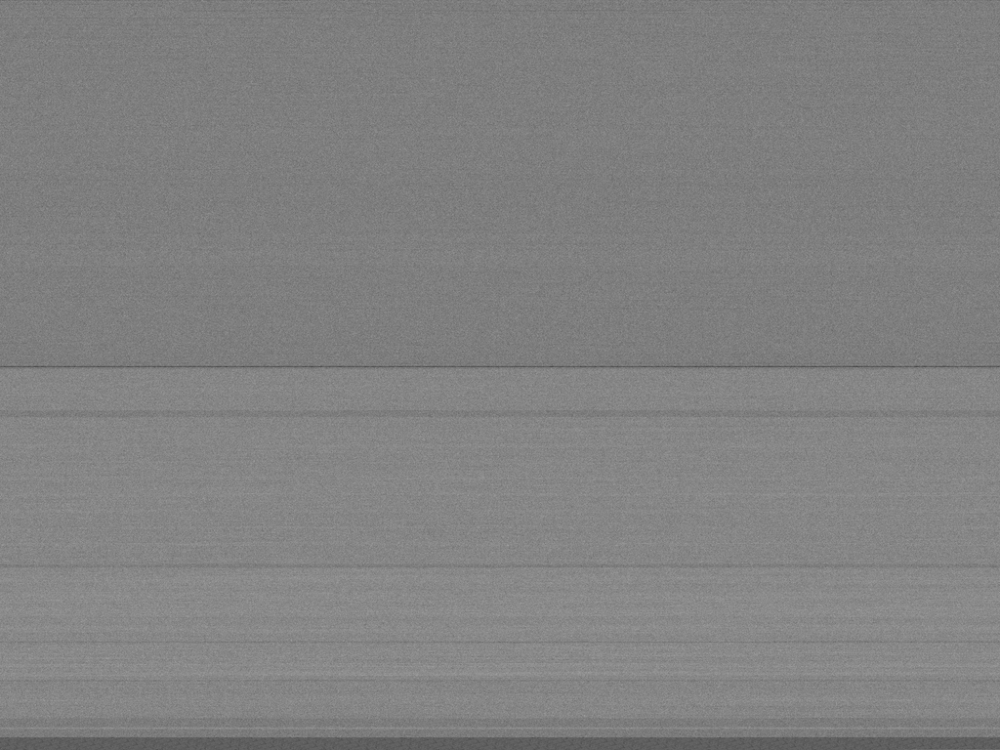
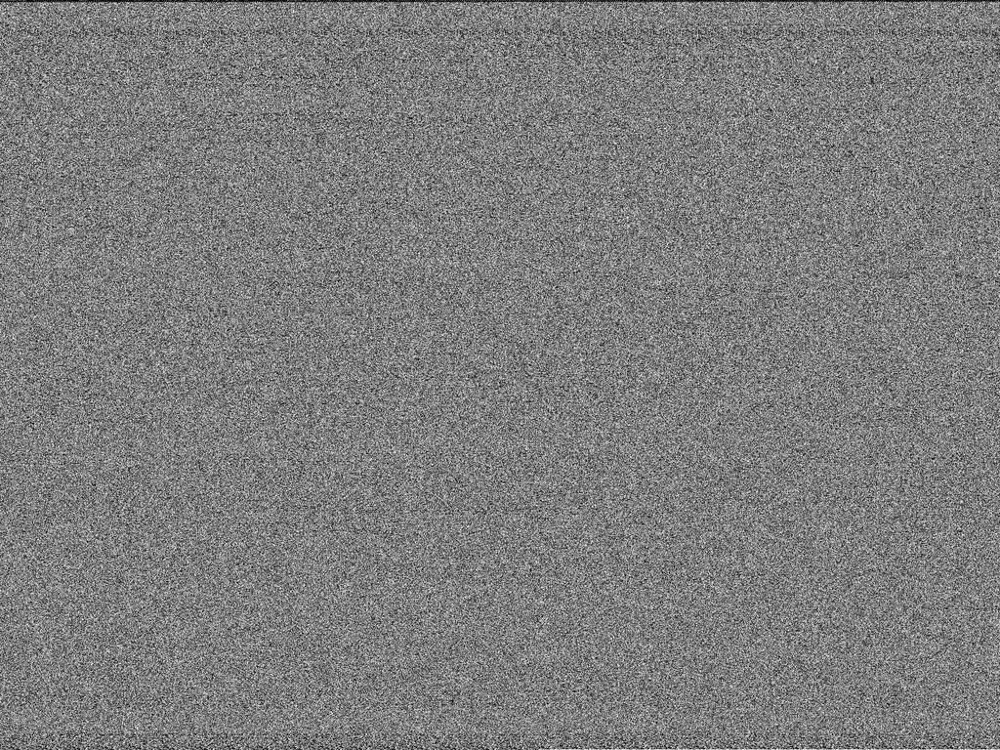
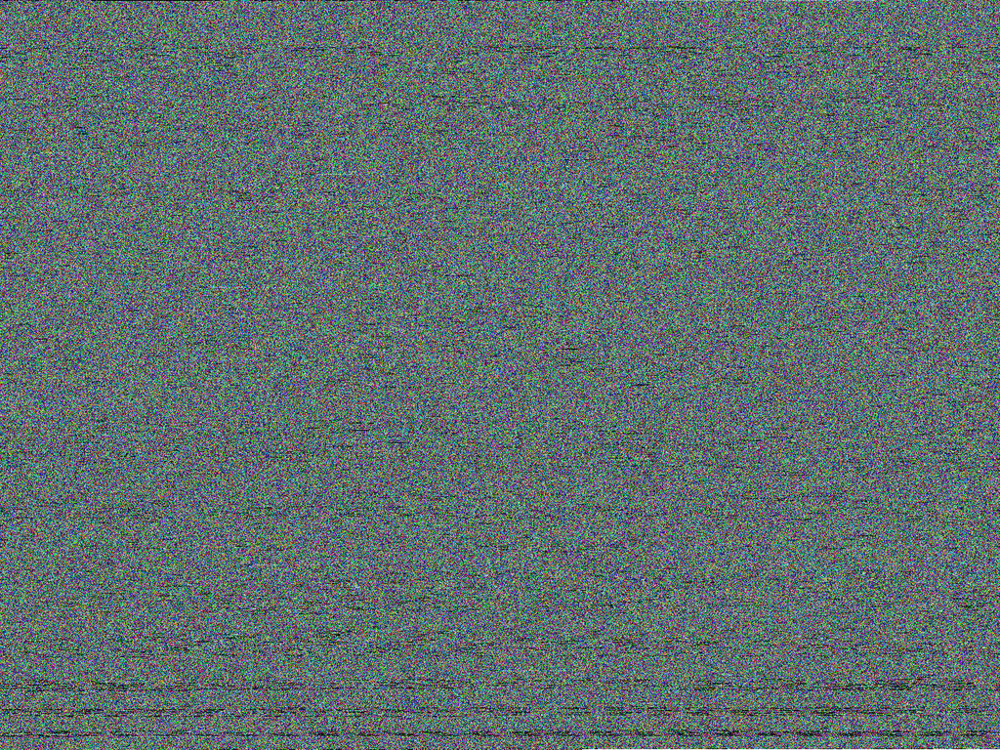
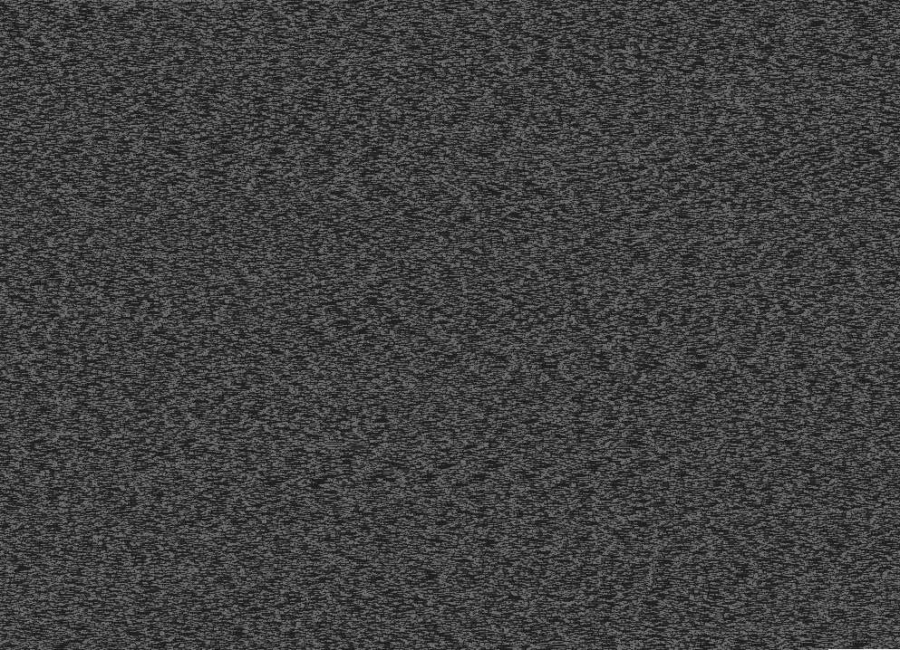
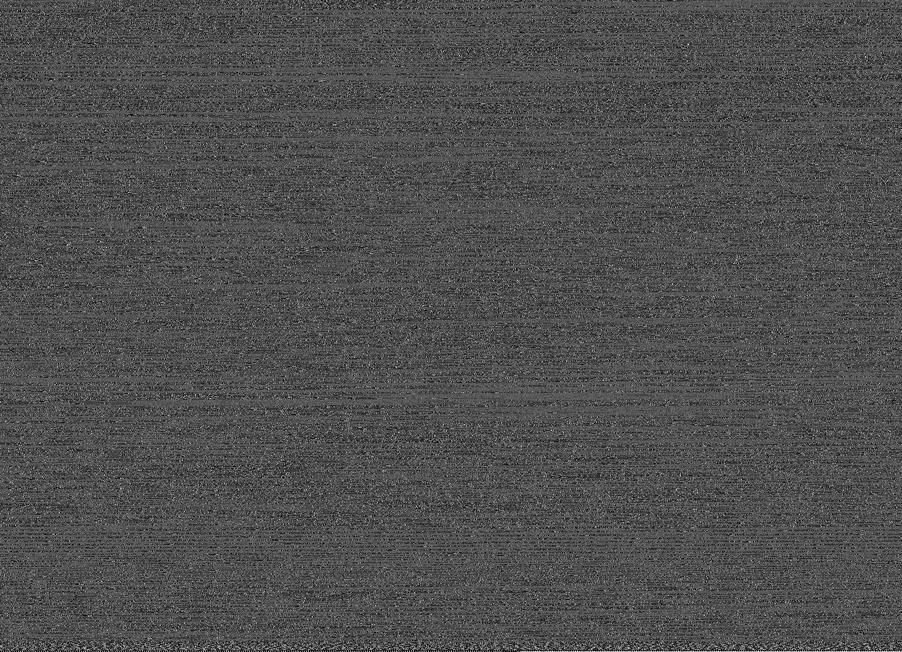

# binpic

Create a PNG from any file. Pitched by [c3er](https://github.com/c3er) at
[devopenspace](https://twitter.com/devopenspace) 2018 (see also:
[bin2img](https://github.com/c3er/bin2img)).

```shell
$ binpic /bin/ls
```

Encode a file as [grayscale image](https://golang.org/pkg/image/#Gray), optionally resize.

```shell
$ binpic -h
Usage of binpic:
  -o string
        output file, will be a PNG (default "output.png")
  -resize string
        resize, if set (default "0x0")
```
## Install

This is a toy project, still want to try it out?

```shell
$ go get github.com/miku/binpic/cmd/...
```

## Gallery

### binpic



### ls


### go



### caffe model file



### protocol buffer



### mp4



### webm



### xml



### leveldb file



