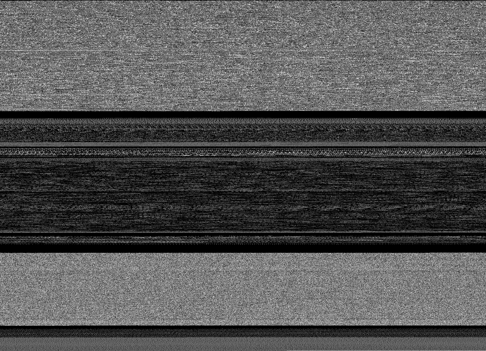
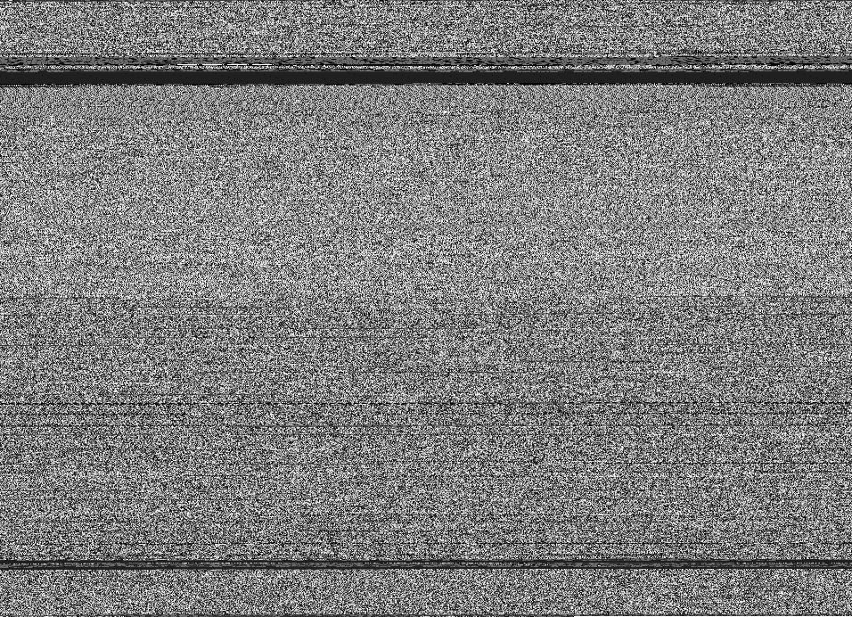
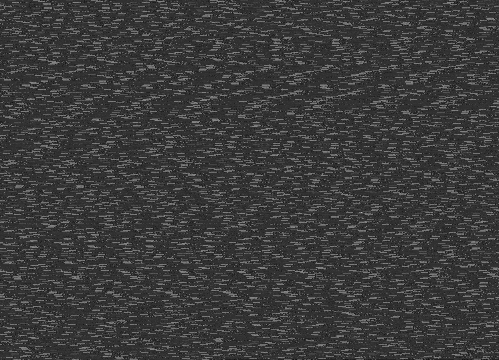
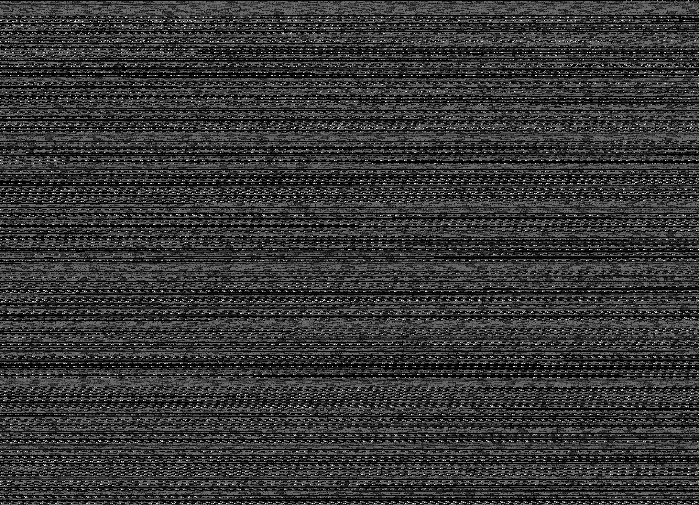
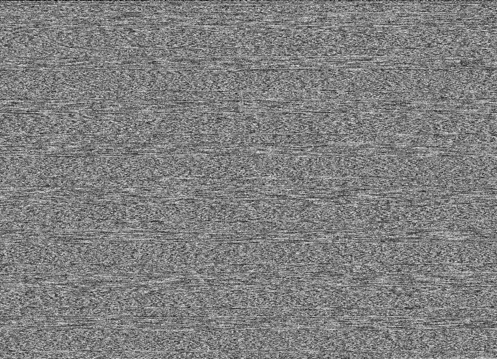
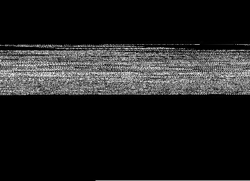

# binpic

Create a PNG from any file. Pitched by [c3er](https://github.com/c3er) at
[devopenspace](https://twitter.com/devopenspace) 2018 (see also:
[bin2img](https://github.com/c3er/bin2img)).

```shell
$ binpic /bin/ls
```

Encode a file as [grayscale image](https://golang.org/pkg/image/#Gray), optionally resize.

```shell
$ binpic -h
Usage of binpic:
  -o string
        output file, will be a PNG (default "output.png")
  -resize string
        resize, if set (default "0x0")
```

Thanks to the beautiful Go standard library packages like
[image](https://golang.org/pkg/image/) and [io](https://golang.org/pkg/io/),
this is little more complex than a *Hello World*. This [simple image
library](https://github.com/disintegration/imaging) helps, too.

## Install

This is a toy project, still want to try it out?

```shell
$ go get github.com/miku/binpic/cmd/...
```

## Gallery

### binpic binary (amd64)


### binpic binary (arm)



### ls (coreutils)


### The go tool


### Caffe model file


### Protocol Buffer


### mp4


### webm


### XML


### LevelDB file


### PDF



### MARC21



### [DBM](https://en.wikipedia.org/wiki/Dbm)



### wav



### d64



